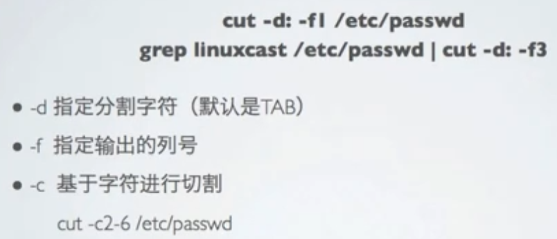

# Linux

> 普通用户使用； 系统的管理
> - 网络
> - 文件处理
> - 查看/找文件内容 
> - 权限
> - 功能
> - 进程

<!-- vim-markdown-toc GFM -->

* [早先笔记](#早先笔记)
  - [虚拟机](#虚拟机)
  - [Linux注意事项](#linux注意事项)
  - [配置文件区别](#配置文件区别)
  - [常见命令](#常见命令)
  - [用户 组 权限](#用户-组-权限)
  - [网络](#网络)
  - [文本处理常用命令](#文本处理常用命令)
  - [启动流程](#启动流程)
  - [快捷键](#快捷键)
  - [安装 Linux 后常见步骤](#安装-linux-后常见步骤)
* [Linux 基础视频教程](#linux-基础视频教程)
  - [I. 系统的基本使用 01-25](#i-系统的基本使用-01-25)
    + [01-07: 介绍和安装](#01-07-介绍和安装)
    + [08-15: 基本使用](#08-15-基本使用)
    + [20-25: 用户 组 和 权限](#20-25-用户-组-和-权限)
  - [II. 系统的管理 26-54](#ii-系统的管理-26-54)
    + [网络管理: 26-30](#网络管理-26-30)
      * [26-27.网络状态查看](#26-27网络状态查看)
      * [28.修改网络配置](#28修改网络配置)
      * [29.网络故障排除](#29网络故障排除)
      * [30.网络管理和配置文件](#30网络管理和配置文件)
    + [进程管理 37-43](#进程管理-37-43)
      * [37.查看进程](#37查看进程)
      * [38-39.进程控制](#38-39进程控制)
    + [内存与磁盘管理: 44-54](#内存与磁盘管理-44-54)
  - [III Shell](#iii-shell)
    + [55-58](#55-58)
    + [59-60 管道和重定向](#59-60-管道和重定向)
    + [61-64 变量，环境变量](#61-64-变量环境变量)
    + [65-68](#65-68)
    + [69-73](#69-73)
    + [79-](#79-)
    + [88-100 sed 和 awk](#88-100-sed-和-awk)
      * [sed 的替换命令](#sed-的替换命令)
  - [命令行的艺术](#命令行的艺术)

<!-- vim-markdown-toc -->

## 早先笔记

### 虚拟机

- 虚拟机，镜像，快照，克隆

- 系统安装 （ BIOS，修改启动盘 ）
  1. 分区（ 格式化 ）
     - 主分区（ 最多4个 （ MBR，GPT ） ），扩展分区（ 逻辑分区（ 可格式化，数据读写 ） ）
  2. 格式化
     - 写入文件系统（ 数据块（ block ），建立inode列表 ）
  3. 硬件设备文件名
     - /dev/sd[a-p][1-9]
       - 第一个逻辑分区从 5 开始
  4. 挂载
       - 必须分区
         - /（ 根分区 ）
         - swap分区（ 交换分区 ）
       - 推荐分区
         - /boot（ 启动分区，200M ）

- 网络配置
  - 换源
  - 桥接( 真实网卡 ), host-only, NAT
  - ifconfig（ 临时修改，需修改配置文件 ）

- 分辨率
  - xrandr
  - cvt 1920 1080
  - xrandr -s 1920x1080


### Linux注意事项

1. 不区分大小写
2. 没有后缀名
3. 挂载

- 服务器注意事项
  - 远程服务器不能关机，只能重启
  - 重启时应该关闭服务
  - 远程配置防火墙时不要把自己提出服务器

### 配置文件区别

> [配置文件](https://www.jianshu.com/p/6d32b166f47d)

- /etc/environment (不要动！)

1. /etc/profile (文件) -> /etc/profile.d/*.sh ( 后者为目录好维护 )

2. /etc/bash.bashrc ( /etc/bashrc )

3. ~/.profile ( ~/.bash_profile )

4. ~/.bashrc

### 常见命令

- hostname
- 网卡配置 ubuntu: /etc/nework/interfaces CentOS: /etc/sysconfig/network-scripts/ifcfg-eth0
- /etc/init.d/networking restart
- chkconfig < service > off        开机自启

- history, !!( 重复上一条命令 ), !num, !?abc, !-n 
- Ctrl + r
- su -( 以新终端环境 ), su

- ls -latr
- cp -rv <SRC> <DST>
- mkdir -p --parent
- which `cmd`         命令位置路径
- whereis `cmd`       位置和帮助手册路径
- wc file             行数，单词数，字节数
- find / -name *

tar -xzvf *.tar.gzip （ 打包和解/压缩 ）

du   计算机目录占用磁盘空间
df   磁盘空间使用情况
free 内存情况
top  任务

### 用户 组 权限

- root用户（ ID 为 0 ），系统用户（ 1~499 ），普通用户 （ 500+ ）
- id，passwd
- whoami，who，w
- useradd [-gGdsu] grp_name user_name，usermod，userdel -r
- groupadd，groupmod，groupdel

- /etc/skel ( 创建新用户时复制目录内容到家目录下 )，/etc/passwd，/etc/shadow，/etc/group

- chown -R user_name file_name，chgrp -R，chmod [ugo+/-rwx | 777] file_name

### 网络

- 修改主机名
  - hostname 
  - /etc/sysconfig/network 中的 HOSTNAME=train.linuxcast.net

- 网络配置
  - IP，子网掩码，网关，DNS
- 排查
  - 自身网络配置
  - 网关是否连通： ping 网关IP
  - DNS解析是否正常： host www.126.com

- 相关命令
  - ping           ( 测试网络连通性 )
  - host, dig    ( 测试DNS解析 )
  - ip route
  - traceroute ( 追踪到达目标地址的网络路径 )
  - mtr            ( 使用 mtr 进行网络质量测试( 结合了 traceroute 和 ping ) )

###  文本处理常用命令

> grep


> cut



> wc


> sort


> diff


> tr


> sed


### 启动流程

1. BIOS( Base IO System 主板上的硬件检测程序 )
2. 引导引导程序代码( MBR, EFI )
3. 引导程序( GRUB ) > 加载文件系统
4. 加载 Kernel 查看本次启动内核输出信息 dmesg
5. init /etc/rc.d/rc.sysinit 运行级别 /etc/inittab

### 快捷键

- ^C
- ^D == Exit
-  ^L

- shell编辑风格
  - Emacs编辑风格 ( set -o vi )
    - ^A
    - ^E
    - ^U
    - ^K
    - ^R
    - ^x: 行首到当前光标替换
    - Esc+. 补全上个参数
    - history
    - !n 执行第 n 行命令
  - vi编辑风格 ( set -o vi )
    - 光标移动
      - 单词之间移动 web

- 修改键位
  - xmodmap -pke
  - xmodmap -e "keycode n = key_name"

### 安装 Linux 后常见步骤

- mirror
- proxy
- editor [ nvim ]
- environment
- shell
- terminal
- font
- hardware [keyboard..]
- change mirrors and update system
- 常见出错背后的三大问题：
  1. 网络
  2. 依赖
  3. 版本


--------
## Linux 基础视频教程

> 视频位置：F:\Download\BilibiliDownload\linux基础

> 涉及内容：Linux 的使用，管理，shell, 服务搭建

<!-- vim-markdown-toc GFM -->

- [I. 系统的基本使用 01-25](#i-系统的基本使用-01-25)
  + [01-07: 介绍和安装](#01-07-介绍和安装)
  + [08-15: 基本使用](#08-15-基本使用)
  + [20-25: 用户 组 和 权限](#20-25-用户-组-和-权限)
- [II. 系统的管理 26-54](#ii-系统的管理-26-54)
  + [网络管理: 26-30](#网络管理-26-30)
    * [26-27.网络状态查看](#26-27网络状态查看)
    * [28.修改网络配置](#28修改网络配置)
    * [29.网络故障排除](#29网络故障排除)
    * [30.网络管理和配置文件](#30网络管理和配置文件)
  + [进程管理 37-43](#进程管理-37-43)
    * [37.查看进程](#37查看进程)
    * [38-39.进程控制](#38-39进程控制)
  + [内存与磁盘管理: 44-54](#内存与磁盘管理-44-54)
- [III Shell](#iii-shell)
  + [55-58](#55-58)
  + [59-60 管道和重定向](#59-60-管道和重定向)
  + [61-64 变量，环境变量](#61-64-变量环境变量)
  + [65-68](#65-68)
  + [69-73](#69-73)
  + [79-](#79-)
  + [88-100 sed 和 awk](#88-100-sed-和-awk)
    * [sed 的替换命令](#sed-的替换命令)
- [命令行的艺术](#命令行的艺术)

<!-- vim-markdown-toc -->


--------
### I. 系统的基本使用 01-25

#### 01-07: 介绍和安装 

- RedHat (收费)
  - Fedora (不稳定)
  - CenOS 
    - init 3 # 切换终端模式
- Debian
  - Ubuntu

#### 08-15: 基本使用 

- 通配符：
  - *, ?, [1-9], {1..9}
- `man` `help` `info` # 帮助
- `cd -`
- `ls -R ` 
- `cp -p -r` # 保留修改时间
- `wc -l`
- `id`
- `cat` | `head` | `tail -f` | `more` | `less` # 文件查看
- `tar` # -cf 打包, -c{z|j}f 压缩和 -x{z|j}f -C 解压 .tar.gz  .tar.bz2

#### 20-25: 用户 组 和 权限

> **USER**

 

- su - [USERNAME]
- sudo # 使用命令需授权
- /etc/passwd，/etc/shadow, /etc/group # 用户信息，密码，组信息
  - username:passwd:uid:gid:comment:homedir:shell

> **权限**

 

 

 

- 目录文件的 x 是可进入


---
### II. 系统的管理 26-54

> 网络管理( net )，包管理( rpm )，进程管理( cpu )，内存管理( mem )，磁盘管理( disk )

#### 网络管理: 26-30

- **ip， 网卡，网关，路径**

##### 26-27.网络状态查看

 

- `mii-tool ens0`: 查看网卡物理连接状态
- 修改 /etc/default/grub 将 ens33 -> eth0

##### 28.修改网络配置

 
 
 

##### 29.网络故障排除


##### 30.网络管理和配置文件


- 配置文件：
    - /etc/NetworkManager/system-connections/有线连接 1.nmconnection
    - /etc/hosts
    - `hostname` 


---
####  进程管理 37-43

##### 37.查看进程

- `ps -efL`: 包含线程
- `pstree`
- `top`: 动态, 动态内存状态


---
##### 38-39.进程控制

- `top -p pid` 
- `./a.sh &` 后台进行挂起
- ^z: 暂停运行
- `jobs` `fg {%id}` `bg {%id}` nohup
- `kill` -l -9


--------
#### 内存与磁盘管理: 44-54

 

- 内存使用率查看
  - free -[m|g]
  - top
- 磁盘使用率查看
  - fdisk -l
  - df -h
  - du: 实际使用大小 ls -l: 包括空洞
  - dd if: input file of: output file bs: block size

- inode datablock
- 符号链接 ln -s afile bfile
- 硬链接 ln afile bfile
- facl
  - getfacl
  - setfacl -m u:user1:r afile


--------
### III Shell 

#### 55-58

- #!/bin/bash
- 产生子进程 ./1.sh bash 1.sh
- 当前终端执行，影响当前环境 source 1.sh | . ./1.sh
- 启动过程：BIOS - MBR - BootLoader(grub) - kernel - systemd - 系统初始化 - shell

#### 59-60 管道和重定向

- |, `<`(文件输入), `>`, >>, 2>, &>(全部重定向)
- /proc/{PID}/fd
- fd: 0 1 2 3
- `read var < /path/to/a/file`


#### 61-64 变量，环境变量

- 赋值
  - `read` var
  - a=123 不能有空格，避免运算
  - letc=$(ls -l /etc) 或 `ls - /etc` 命令值赋值
  - 使用 '' "" 赋值
- 引用变量: echo ${变量名}
- 作用范围：只在当前shell进程
  - `export` 导出: 子进程获取到父进程变量
  - `unset`

- 环境变量
  - `set`, `env`
  - $PATH
- 预定变量, 位置变量
  - $?: 判断上条命令是否执行成功
  - \$$: 当前进程 PID
  - $0: 当前进程名称
  - $#: 位置参数的数量
  - $\* $@: 所有位置参数
  - \${1..10}: 读入参数变量  pos1=${1-_}

- 配置文件
  - /etc/profile
  - /etc/profile.d/
  - ~/.bash_profile
  - ~/.bashrc
  - /etc/bashrc
  - su - {user}: 加载所有配置文件

#### 65-68 

- 数组 ( var )
 


- let (( a=1+1 ))
- expr 1 + 1

- **特殊字符** 

| 字符                 | 作用               | 使用                              |
|----------------------|--------------------|-----------------------------------|
| ''                   | 完全引用           | 不解释 '$var'                     |
| ""                   | 不完全引用         | 解释 "$var"                       |
| ``                   | 执行命令           | a=\`expr 1 + 1\`                  |
| ()                   | 数组，产生子 shell | IPS=( ip1 ip2 ip3 ) ( var=123 )   |
| (())                 | let 数值运算       | ((a=1+1))                         |
| $()                  |                    | cmd=$(ls)                         |
| []                   | `test`             |                                   |
| <>                   | 重定向             | fd\<stdout; stdout\>fd            |
| {}                   |                    | {0..9} `cp -v /etc/passwd{,.bak}` |
| + -*/ ><= && \|\| !  | 算数 比较 逻辑     |                                   |
| # ; . : ;; - * ?  \| |                    |                                   |

#### 69-73

- exit 127
- test( [] ): [[ 1 < 2 ]] [[ -e|-f|-d|-x /etc ]]


```bash
# 分支
if ; then

fi

[ "$x" = "$y" ] && return 0

case "$1" in
  )
  cmd1
  ;;
  )
  cmd2
  ;;
esac

# 循环
for i in {0..9}
do
  cmd
done

for (( i=0; i<=10; i++ ))
do
  cmd
done

# while until
shift # 
```

#### 79-

- 系统脚本: /etc/init.d/functions

#### 88-100 sed 和 awk

- **行编辑器** 
- 非交互式

##### sed 的替换命令


--------
### 命令行的艺术

- man bash
- man readline

| Command      | 作用                       |
|--------------|----------------------------|
| man readline | 输入行快捷键               |
| C-x C-e      | 打开编辑器编辑当前输入命令 |
|              | <++>                       |

# Linux

> 普通用户使用； 系统的管理

## 早先笔记

### 虚拟机

- 虚拟机，镜像，快照，克隆

- 系统安装 （ BIOS，修改启动盘 ）
  1. 分区（ 格式化 ）
     - 主分区（ 最多4个 （ MBR，GPT ） ），扩展分区（ 逻辑分区（ 可格式化，数据读写 ） ）
  2. 格式化
     - 写入文件系统（ 数据块（ block ），建立inode列表 ）
  3. 硬件设备文件名
     - /dev/sd[a-p][1-9]
       - 第一个逻辑分区从 5 开始
  4. 挂载
       - 必须分区
         - /（ 根分区 ）
         - swap分区（ 交换分区 ）
       - 推荐分区
         - /boot（ 启动分区，200M ）

- 网络配置
  - 换源
  - 桥接( 真实网卡 ), host-only, net
  - ifconfig（ 临时修改，需修改配置文件 ）

- 分辨率
  - xrandr
  - cvt 1920 1080
  - xrandr -s 1920x1080

### Linux注意事项

1. 不区分大小写
2. 没有后缀名
3. 挂载

- 服务器注意事项
  - 远程服务器不能关机，只能重启
  - 重启时应该关闭服务
  - 远程配置防火墙时不要把自己提出服务器

### 配置文件区别

> [配置文件](https://www.jianshu.com/p/6d32b166f47d)

- /etc/environment (不要动！)

1. /etc/profile (文件) -> /etc/profile.d/*.sh ( 后者为目录好维护 )

2. /etc/bash.bashrc ( /etc/bashrc )

3. ~/.profile ( ~/.bash_profile )

4. ~/.bashrc

### 常见命令

- hostname
- 网卡配置 ubuntu: /etc/nework/interfaces CentOS: /etc/sysconfig/network-scripts/ifcfg-eth0
- /etc/init.d/networking restart
- chkconfig < service > off        开机自启

- history, !!( 重复上一条命令 ), !num, !?abc, !-n 
- Ctrl + r
- su -( 以新终端环境 ), su
- 

ls -latr

cp -rv <SRC> <DST>

mkdir -p --parent
which `cmd`         命令位置路径
whereis `cmd`       位置和帮助手册路径
wc file             行数，单词数，字节数
find / -name *

tar -xzvf *.tar.gzip （ 打包和解/压缩 ）

du   计算机目录占用磁盘空间
df   磁盘空间使用情况
free 内存情况
top  任务

### 用户，组，权限

- root用户（ ID 为 0 ），系统用户（ 1~499 ），普通用户 （ 500+ ）
- id，passwd
- whoami，who，w
- useradd [-gGdsu] grp_name user_name，usermod，userdel -r
- groupadd，groupmod，groupdel

- /etc/skel ( 创建新用户时复制目录内容到家目录下 )，/etc/passwd，/etc/shadow，/etc/group

- chown -R user_name file_name，chgrp -R，chmod [ugo+/-rwx | 777] file_name

### 网络

- 修改主机名
  - hostname 
  - /etc/sysconfig/network 中的 HOSTNAME=train.linuxcast.net

- 网络配置
  - IP，子网掩码，网关，DNS
- 排查
  - 自身网络配置
  - 网关是否连通： ping 网关IP
  - DNS解析是否正常： host www.126.com

- 相关命令
  - ping           ( 测试网络连通性 )
  - host, dig    ( 测试DNS解析 )
  - ip route
  - traceroute ( 追踪到达目标地址的网络路径 )
  - mtr            ( 使用 mtr 进行网络质量测试( 结合了 traceroute 和 ping ) )

###  文本处理常用命令

> grep


> cut


> wc


> sort


> diff


> tr


> sed


###  启动流程

1. BIOS( Base IO System 主板上的硬件检测程序 )
2. 引导引导程序代码( MBR, EFI )
3. 引导程序( GRUB ) > 加载文件系统
4. 加载 Kernel 查看本次启动内核输出信息 dmesg
5. init /etc/rc.d/rc.sysinit 运行级别 /etc/inittab

### 快捷键

- ^C
- ^D == Exit
-  ^L

- shell编辑风格
  - Emacs编辑风格 ( set -o vi )

    ^A
    ^E

    ^U
    ^K

    ^R
    
    ^x: 行首到当前光标替换
    
    Esc+. 补全上个参数
    history
    
    !n 执行第 n 行命令
    
  - vi编辑风格 ( set -o vi )
    - 光标移动
      - 单词之间移动 web
  
- 修改键位
  - xmodmap -pke
  - xmodmap -e "keycode n = key_name"

### 安装 Linux 后常见步骤

- mirror
- proxy
- editor [ nvim ]
- environment
- shell
- terminal
- font
- hardware [keyboard..]
- change mirrors and update system
- 常见出错背后的三大问题：
  1. 网络
  2. 依赖
  3. 版本

## Linux 基础视频教程

> F:\Download\BilibiliDownload\linux基础

> __系统的基本使用:__
> 01-07: 介绍和安装
> 08-15: 基本使用
> 16-19: vim
> 20-25: 用户，组 和 权限
> __系统的管理:__
> 26-30: 网络管理
> 31-35: 包管理
> 36-43: 进程管理
> 44- 内存磁盘管理

### 


### 什么玩儿

- asdf