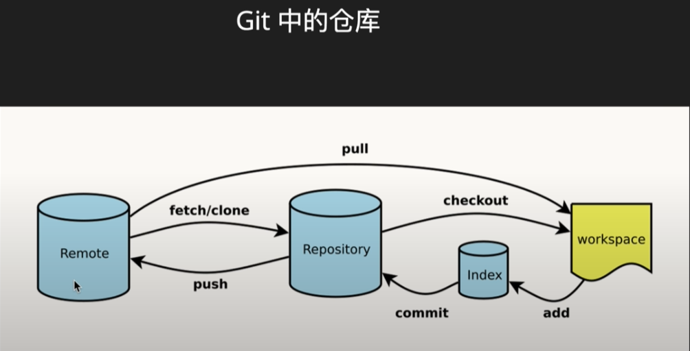

# Git 

> [后盾人git](https://www.bilibili.com/video/BV154411g7Wm)
> 目的：git 的基本能使用 管理笔记等

##

- 基本操作
  - SVN Git
  - git config
  - init
  - add .; commit -m "xxx"
  - .gitignore
  - rm [--cached]
  - mv
  - log
  - commit --amend: 修改提交信息内容
  - git restore
  - git config --global alias.a add

- 分支
  - HEAD 指针
  - git branch -d
  - git checkout -b # 创建分支并且
  - git switch
  - git merge
  - git merge --merged --no-merged
  - git stash # 在分支中修改了文件但没有提交时的暂存 
    - git stash list
    - git stash appy
    - git stash drop stash@{0}
  - git tag
  - git archive master --prefix='/home/raily' --forma=zip > xxx.zip

- rebase
  - 子分支移动至master中的最新提交点

- git remote -v


## 互联网人都该懂点 Git

> Link: [互联网人都该懂点 Git](https://www.youtube.com/watch?v=29q6zwRGywk&list=PLK2w-tGRdrj5jO9Y1k2iAPCw7iSo6YVdx)

### 常用命令
```zsh
git config --global user.email "xxx@xxx.com"
git config --global user.name "xxx"
git init
git add remote origin 

git branch [-d]
git checkout [-b]
git log --online
git show {hash_id}
```

### #01 什么是 git

 

### #02 基操

- git config
- git add
- git commit
- git rm --cached
- git restore
- git branch
- git checkout
- git log

### #03 分支


# git #

~/.gitconfig; ./.git/conifg; ./.gitignore; ~/.bash_profile

git config --list

git config core.autocrlf https://blog.csdn.net/starry_night9280/article/details/53207928 # 换行

git config --global user.email email
git config --global user.name username

git init
git clone


## 本地，暂存，仓库 ##

* git status
* git add        # 放入暂存区
* git reset
* git commit  # 放入仓库 --amend( 修改新提交 )
* git mv         # 重命名
* git log

## 控制 ##

git rm --cached # 1. 在暂存区（未追踪），unstage 2. 删除库中，不删除本地
git reset HEAD  # 在暂存区（已追踪），还未提交，unstage
git checkout    # 回退

## 分支 ##

提交后才有跟踪

* git branch                      # 创建，查看分支；-d 删除分支；-a 包含远程分支
* git checkout -b                 # 切换分支
* git merge < branch >            # 切换至主分支合并
* git branch --merged
* git stash list/apply/drop/pop   # 临时暂存
* git rebase master               # replace base 将分支移到最新的主分支

* git tag # 标签
* git archive [分支] --prefix='path' --forma=zip > name.zip

## 远程操作 ##

- ~/.ssh/config # 多个用户配置 ssh 配置 修改host

* git remote add origin git@github.com:
* git remote - v
* git pull -rebase origin master
* git push -u origin master

* git pull origin [远程分支]:[本地分支]
* git push ( origin --delete < branch > ) # 对远程操作


