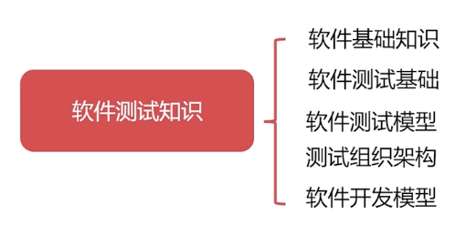
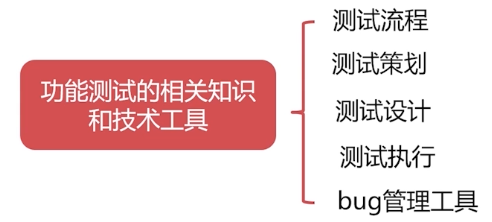
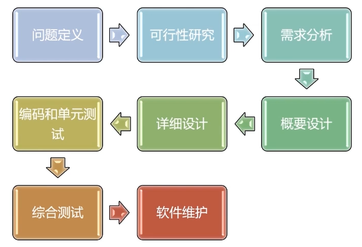
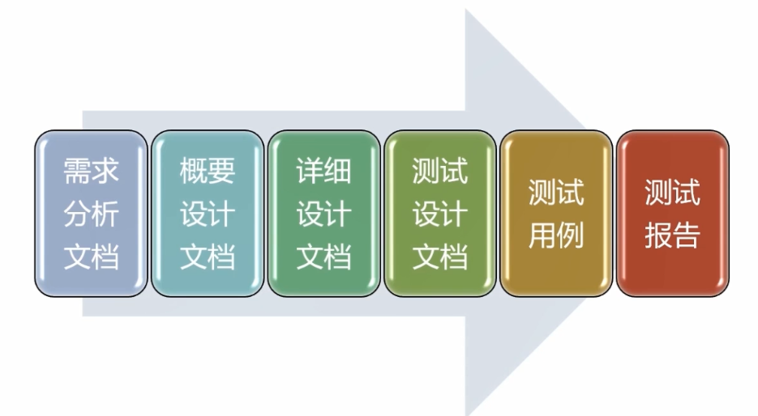
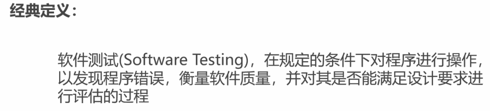
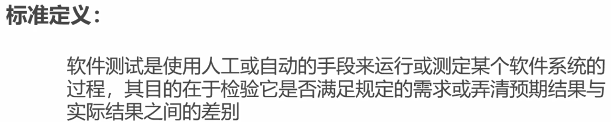
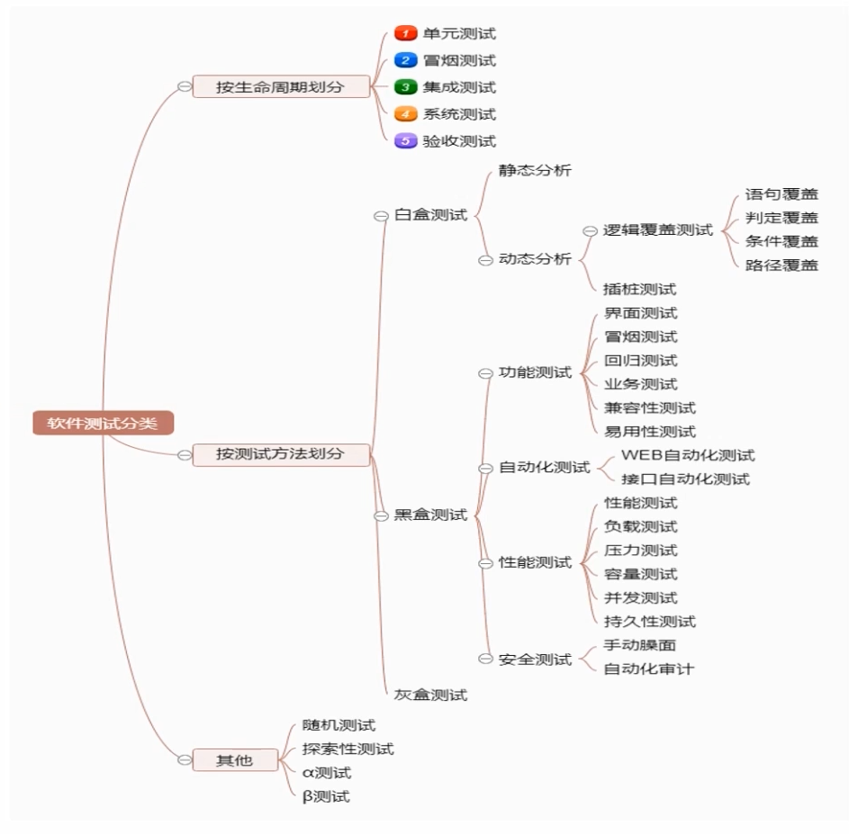
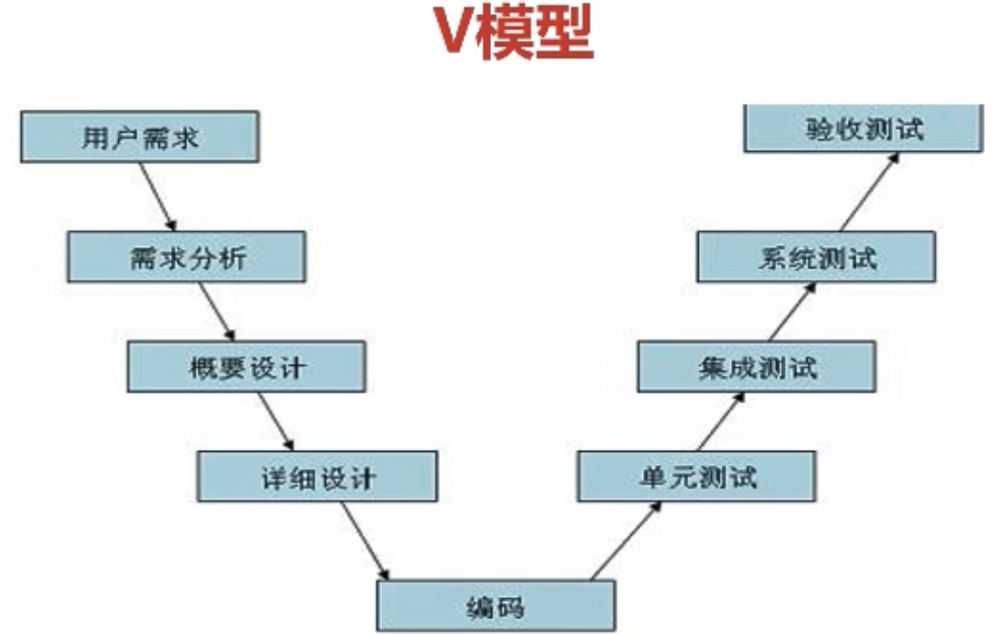
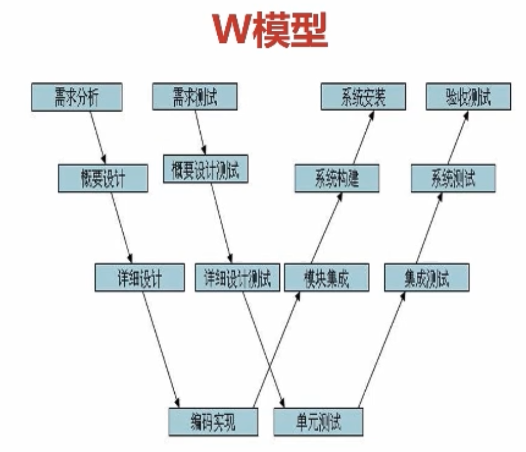

# 测试 #

## 1-1 ##

## 1-2 ##

- 测试思想
  1. 验证功能正确
  2. 默认有错误并找出错误

- 面临问题
  1. 软件规模大，如何充分有效的测试。
  2. 基本测试简单需增强能力

## 1-4 ###

1. 测试基础，测试流程，各个过程的要求。
2. 流程
3. 测试设计
4. 测试执行管理
5. 测试项目实践
6. 测试技术
7. 手机APP测试
8. 测试总结

## 2- ( 1-5 ) ##

### 软件 ###

- 程序：代码
- 数据：数据库等其他信息
- 相关文档：开发，维护

### 软件特性 ###

1. 形态特性 无形不可见
2. 智能特性 计算，分析，判断，决策
3. 开发特性 IDE
4. 质量特性 缺陷
5. 生产特性 复制
6. 管理特性 架构
7. 环境特性 环境依赖，兼容性
8. 维护特性 升级，优化，功能更新，补丁，重构
9. 废弃特性 难被废弃，易被嫌弃
10. 应用特性 业务

### 软件生命周期 ###

- __8个阶段__

### 软件开发模型 ###

- 瀑布模型
- 原型模型
- 螺旋模型 强调风险分析
- 敏捷模型

### 软件开发文档 ###

## 2- ( 6-13 ) ##

### 软件测试概念 ###

- 测试目标：是否满足需求，发现问题。

- 测试原则
  1. 测试应追溯到用户需求
  2. 尽早启动测试工作
  3. 28定律
  4. 不可能穷尽
  5. 杀虫剂原则
  6. 回归测试

### 软件测试分类 ###

- 冒烟测试：主要功能的测试

### 测试环境 ###

测试环境 = 软件 + 硬件 + 网络
测试用例 = 输入 + 输出 + 测试环境

### 常见测试模型 ###

## 4-1 ##

### 测试用例 ###

- 用例内容( 可重复性，可验证性，需求可追踪性 )
  1. 前置条件
  2. 测试步骤
  3. 测试数据
  4. 预期结果

- 测试方法
  1. 等价类划分
  2. 边界值分析法
  3. 因果图设计法
  4. 判定表设计法
  5. 正交实验法
  6. 场景法

- 等价类划分
  1. 范围值：1个有效2个无效等价类
  2. 布尔值：1个有效1个无效等价类

- 因果图 - 判定表设计法
  - 判定表
    1. 条件桩 内容
    2. 动作桩
    3. 条件项 取值
    4. 动作项

- 正交实验法
  - Ln(t^c) n: 次数（行数） t: 水平数 c: 列数（因素数）

- 场景法

### 测试报告 ###

- 测试报告需要包含哪些内容?
  1. 测试项目简介
  2. 编写目的
  3. 测试背景
  4. 测试环境
  5. 测试版本说明
  6. 测试需求
  7. 测试结果
  8. 风险分析
  9. 测试结论与建议