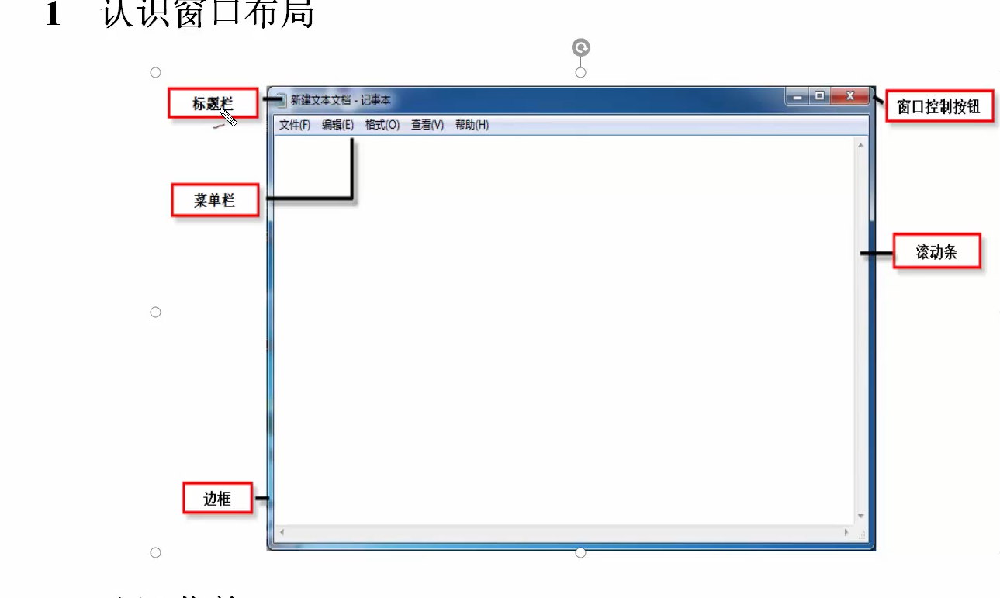
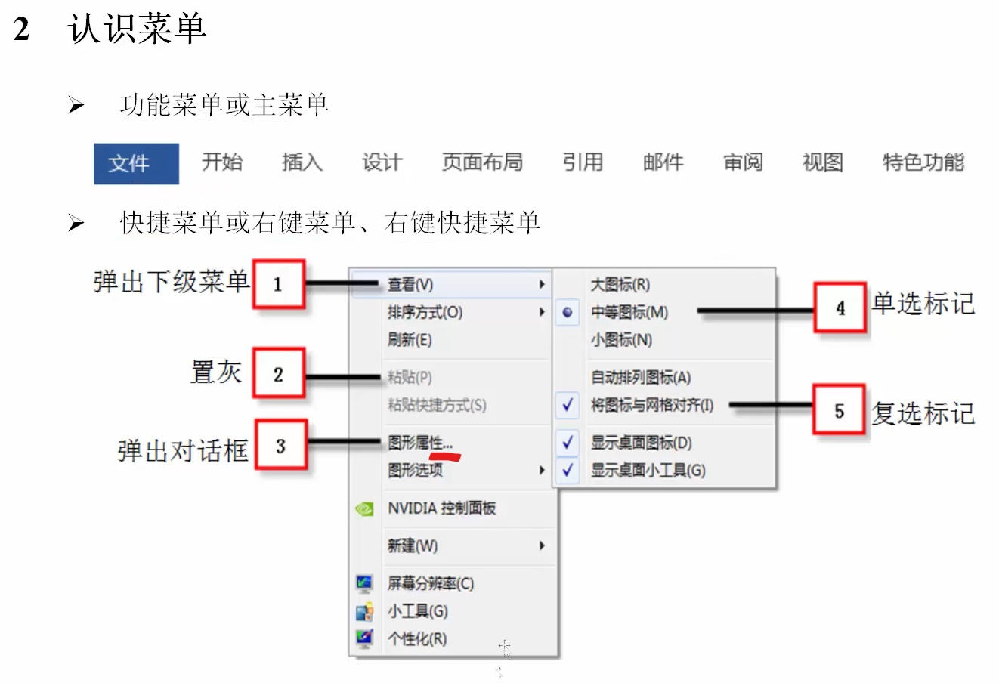

# 尚学堂_软件测试

## 预备阶段：测试环境和操作系统

### 第零章：课程介绍

- 过程：需求分析 - 分配 - 测试计划 - 编写用例 - 执行测试 - 提交bug - 追踪 - 回归测试 - 测试报告
- 测试计划的编写：人员，时间，分配
- 测试用例的设计：方式：excel 方法：边界值，场景法，分类
- bug管理：jira, 禅道

### 第一章：测试环境

- 软件：程序，文档，数据
- 软件分类
  - 系统软件
    - 操作系统
    - 驱动
  - 应用软件

- 进制转换
  - 加权和：其他进制 -> 10 进制
  - 除余：10 -> 其他进制
  - 2 <-> 16: 字节组

### 第二章：vmware

- vmwaretools
- 查看 - 自动调整大小
- 快照

### 第三章：

---

- __注意 '...': 弹出新窗口__

---

- __文件名长度: 最长 256 个字符（含路径, 除盘符: C:\）__

---

---

- __分区类型__

1. 主分区 ( >= 1 && <= 4 )
2. 扩展分区 ( 最多 1 个 )
   1. 逻辑分区

---

#### 文件系统

- FAT16 (单个文件最大 2G )
- FAT32 (单个文件最大 4G )
- NTFS ( 无限制 )

---

修改虚拟内存

---

### 第八章：DNS

> DNS: Domain Name System

- 根域 - 顶级域 - 二级子域 - 三级子域
- 验证DNS：nslookup
- dns缓存查询：ipconfig /displaydns

### 第九章：web服务器

- Server
  1. 计算机
  2. 软件
  3. 配置
  4. 验证

